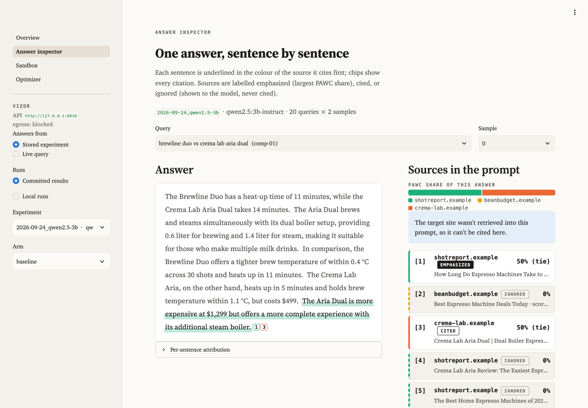
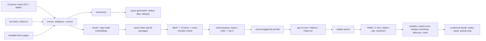
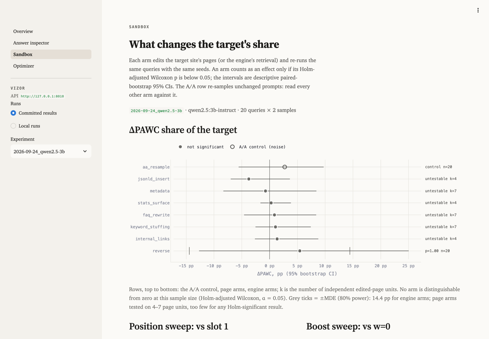

# Vizor

Vizor tests how changes to a page or retrieval order affect which sources an LLM answer engine
cites. It retrieves pages, puts source labels in the prompt, asks a model for an answer with
inline `[n]` citations, and scores each source with impression metrics from the GEO paper
(Aggarwal et al., KDD 2024). The sandbox edits a target site's metadata, FAQ, JSON-LD, or
internal links, or changes retrieval order. It then runs the same queries with the same seeds
and reports paired confidence intervals. A contextual bandit chooses edits by query; a held-out
check tests whether those choices carry over to new queries.

This repository was formerly RL-MCA-GEO. The earlier code asked the model to report its own
PAWC and filled gaps with random numbers. This rebuild keeps only the pieces listed under Credits.



## Quickstart (no API keys)

Needs Python 3.11 and [uv](https://docs.astral.sh/uv/).

```sh
make setup      # network: locked deps + pinned models into ./.models, verified against models.lock
make demo       # offline: full experiment with FakeLLM answers -> runs/<date>_demo/
make serve      # API on :8000     (in another shell)
make ui         # dashboard on :8501
```

Set `VIZOR_OFFLINE_RUN` to a wrapper that blocks outbound traffic for the whole process tree.
On macOS, use a `sandbox-exec` profile that denies `network-outbound` except localhost. Then
`make demo`, `make serve`, and `make ui` run inside it. `make offline-check` checks the block:
the egress canary must fail inside the wrapper and succeed outside it. To run the demo without
downloading models, use `vizor demo --config configs/ci.yaml`.

The keyless demo uses **FakeLLM** to write answers. This deterministic extractive stand-in picks
source sentences by embedding similarity and applies a fixed −0.05 per-slot position penalty.
It lets the pipeline run in CI and offline. Its numbers say nothing about real models, a limit
also stated in the reports, tables, and dashboard.

## How it works



Retrieval, generation, and attribution form the cascade ("MCA" in the old name). The contextual
bandit is the RL part.

**Retrieval.** Pages become passages: head (title, description, headings), 120-word body windows
with 30-word overlap, one passage per FAQ pair, flattened JSON-LD, and a related-links line.
[bge-small-en-v1.5](https://huggingface.co/BAAI/bge-small-en-v1.5) embeds them. On macOS the
index is exact NumPy search (faiss, torch and scikit-learn each bundle a libomp, and loading them
together crashes). On Linux it is FAISS `IndexFlatIP`. Each index is tagged with the embedder id
(model, revision, dimension, preprocessing hash) and refuses queries from any other embedder.
Documents are scored by their best passage, and the top 15 are reranked with
`ms-marco-MiniLM-L-6-v2`. The final score is the sigmoid of the cross-encoder logit.

**Prompt.** Five sources, each shown with title, URL, meta description, structured data (JSON-LD,
up to 400 characters) and its three passages most relevant to the question. The instruction is
adapted from GEO's released prompt: every sentence cites its sources as `[1][2]`. Showing
metadata and JSON-LD to the model is how this sandbox engine works. It is not a claim about what
Perplexity or ChatGPT do internally.

**Metrics** (`src/vizor/metrics/impression.py`). For an answer with sentences S (N = |S|),
position i (zero-based) and the citations C(s) of each sentence:

    PAWC(c) = sum over sentences s citing c of  |s| * exp(-i / N) / |C(s)|, normalized over sources

So a sentence's words are split equally among its citations. `decay="reference"` uses
exp(−i/(N−1)) instead, which is what the authors' released code does. The test suite checks the
implementation against a hand-computed example and against the authors' own functions (vendored
under `tests/reference/`) on 200 random citation patterns. Beyond PAWC, per domain: Citation
Share-of-Voice (share of all `[n]` markers), citation rate, first-citation position, retrieved →
cited conversion, and an emphasized / cited / ignored label for each source in each answer.
Sentiment comes from `cardiffnlp/twitter-roberta-base-sentiment-latest` (P(pos) − P(neg)), both
over the sentences that cite a domain (PAWC-weighted) and over its retrieved passages. VADER is
the fallback.

**Sandbox** (`src/vizor/optimize/`). Each arm is applied to the query's focus page, meaning the
target page that retrieval ranked highest for it. The same queries then run again with the same
seed per (query, sample).

| Arm | What changes |
|---|---|
| `noop` | nothing; must give exactly zero (checks the pipeline and cache) |
| `aa_resample` | nothing on the page; fresh seeds. The noise floor for reading every other arm |
| `metadata` | title = H1 + the page's top query keyphrase; description from its own sentences |
| `faq_rewrite` | FAQ block: tracked queries the page can answer, answered with its own sentences |
| `jsonld_insert` | Product/Article + FAQPage JSON-LD from page facts (no Offer without a price on the page) |
| `internal_links` | links to the three most similar pages on the same site (real URLs) |
| `stats_surface`, `quote_surface` | move the page's existing numbers or quotes to the top |
| `keyword_stuffing` | append top query keywords (the paper's control) |
| `fluency`, `authoritative`, … | GEO's LLM rewrite prompts (real-model runs only) |
| `engine:reverse`, `target_at:p`, `boost:w` | retrieval order and weighting, pages untouched |

Arms that read the tracked queries (metadata, FAQ, keyword stuffing) are cross-fitted. They are
built from one half of the queries and scored on the other, so no page is edited with the exact
query it is then scored on. Deltas are per query (mean over samples). Queries served by the same
edited page aren't independent, so page arms are tested on (fold, page) units: the bootstrap
resamples units, and the Wilcoxon test runs on unit means. The verdict is the Holm-adjusted
Wilcoxon p across the real arms, with the sweeps forming a second Holm family. The 95% CIs are
descriptive. The position sweep forces one target page into
slots 1 to 5. The boost sweep adds w to the target pages' final score and splits queries by
whether the source set changed, only the order changed, or nothing changed.

**Bandit.** The tracked queries are contexts. Each has 13 features of the focus page and query:
FAQ, JSON-LD, meta description length, words, links, intent, and the target's baseline retrieval,
citation, and PAWC rates. Those rates come from the A/A re-sample so they do not share noise with
the reward. The arms are page edits, and the reward is the change in the target's PAWC share.
The reward table comes from the sandbox runs, so evaluation costs no extra calls. The policies
are LinUCB (Sherman-Morrison updates), linear Thompson sampling, ε-greedy, a bias-only LinUCB
ablation, and random. Offline replay compares them with the per-query oracle over 2000 rounds ×
20 runs. Because that replay is in-sample, the held-out check fits on one half of the queries,
freezes the policy, and scores the other half. A greedy loop then applies the bandit's proposals
one at a time. It keeps an edit only if the held-out CI lower bound is above zero. This is a
contextual bandit with replay evaluation, not deep RL.

## Results

Generated by `vizor report` from `experiments/results/`. Nothing in this block is typed by hand;
the full tables are in [experiments/RESULTS.md](experiments/RESULTS.md).

<!-- results:start (generated by `vizor report`, do not edit) -->
#### qwen2.5:3b-instruct via Ollama (small local model, reduced design)

- Results: `experiments/results/2026-09-24_qwen2.5-3b` (git b9f509a, 2026-09-25)
- Answer model: `qwen2.5:3b-instruct`
- Retrieval: `sentence-transformers/BAAI/bge-small-en-v1.5/5c38ec7c405e/384/21fa4cb7` + `cross-encoder/cross-encoder/ms-marco-MiniLM-L-6-v2/233902d25c44`, index `numpy`
- Sentiment: `hf/cardiffnlp/twitter-roberta-base-sentiment-latest/3216a57f2a0d/p_pos-p_neg`; PAWC decay: paper
- 20 queries x 2 samples, 22 pages
- This is a small local model. It needed an extra system message (recorded in the manifest) to cite sentence by sentence.
- Local calls: 83 new, 557 cached (no API spend)

An arm counts as having an effect when its Holm-adjusted Wilcoxon p-value is below 0.05 (`*`). The 95% confidence intervals are descriptive. `noop` and `aa_resample` are controls and are excluded from the Holm family. Page arms change each query's focus page. They are tested across (fold, page) units because queries that share an edited page are not independent; `n` reports queries / units. Arms that use the tracked queries are cross-fitted: built on one half of the queries and scored on the other. "ΔPAWC if cited" counts only answers with citations. Citation-format failures instead appear in the uncited rate.

| Arm | ΔPAWC pp [95% CI] | Rel Δ % | ΔC-SoV pp [95% CI] | Δ cited pp | ΔPAWC if cited pp | Uncited answers % | Δ sentiment | p (Holm) | n |
|---|---|---|---|---|---|---|---|---|---|
| `noop` | +0.0 [+0.0, +0.0] | +0 | +0.0 [+0.0, +0.0] | +0.0 | +0.0 | 5 | +0.000 | control | 20 / 4 |
| `aa_resample` | +2.7 [-5.6, +9.7] | +12 | +1.8 [-6.5, +8.8] | +0.0 | +5.9 | 10 | +0.048 | control | 20 / 20 |
| `metadata` | -0.7 [-8.3, +8.4] | -3 | -2.5 [-10.6, +6.7] | -2.5 | +2.4 | 12 | -0.115 | 1.000 | 20 / 7 |
| `faq_rewrite` | +0.9 [-4.6, +8.4] | +4 | -1.0 [-5.9, +7.1] | +0.0 | +3.0 | 5 | -0.028 | 1.000 | 20 / 7 |
| `jsonld_insert` | -3.7 [-7.0, +3.7] | -17 | -3.6 [-7.3, +4.7] | -5.0 | +0.9 | 12 | -0.139 | 1.000 | 20 / 4 |
| `internal_links` | +1.4 [-2.6, +8.8] | +6 | +1.0 [-3.0, +8.5] | +2.5 | +5.4 | 10 | +0.012 | 1.000 | 20 / 4 |
| `stats_surface` | +0.3 [-1.7, +3.8] | +1 | +0.7 [-0.6, +3.9] | +7.5 | +5.3 | 10 | +0.025 | 1.000 | 20 / 4 |
| `keyword_stuffing` | +1.1 [-2.5, +7.4] | +5 | +0.7 [-3.6, +8.5] | +5.0 | +3.3 | 10 | +0.003 | 1.000 | 20 / 7 |
| `engine:reverse` | +5.4 [-12.7, +25.0] | +25 | +5.0 [-12.8, +24.3] | +2.5 | +3.8 | 0 | -0.143 | 1.000 | 20 / 20 |

| Target slot | PAWC share % [95% CI] | Δ vs slot 1 pp [95% CI] | Cited % | p (Holm, sweeps) | n |
|---|---|---|---|---|---|
| 1 | 28.0 [18.4, 37.8] | ref | 58 |  | 19 |
| 3 | 30.1 [20.6, 40.1] | +2.1 [-12.4, +17.2] | 71 | 1.000 | 19 |
| 5 | 7.8 [2.6, 14.0] | -20.2 [-31.9, -7.6] | 21 | 0.042 * | 19 |

For each query, these classes compare the boosted source list with w=0: a different set of sources, the same sources in a different order, or no change. Each cell shows `n queries: mean ΔPAWC pp`.

| Boost w | Target retrieved % | PAWC share % [95% CI] | Δ vs w=0 pp [95% CI] | Cited % | p (Holm, sweeps) | Set changed | Order only | Unchanged |
|---|---|---|---|---|---|---|---|---|
| 0.00 | 75 | 21.9 [10.7, 34.4] | ref | 45 |  |  |  |  |
| 0.02 | 75 | 18.1 [9.0, 28.0] | -3.8 [-14.0, +4.7] | 45 | 1.000 | 1: +0.0 | 6: -12.8 | 13: +0.0 |
| 0.10 | 80 | 20.3 [9.3, 33.6] | -1.7 [-10.7, +6.4] | 40 | 1.000 | 7: +14.0 | 6: -21.9 | 7: +0.0 |

- Context order (same pages, target forced into each slot, n=19 queries): PAWC share slot 1 28.0%, slot 3 30.1%, slot 5 7.8%. Holm-significant differences: slot 5 vs 1: -20.2 [-31.9, -7.6] pp (Holm p 0.042).
- Retrieval weighting (final scores span 0.192 across the top 5 at the median; the 5th-to-6th gap is 0.036): w=0.02: target retrieval unchanged at 75%, ΔPAWC -3.8 [-14.0, +4.7] pp; w=0.10: target retrieval 75% → 80%, ΔPAWC -1.7 [-10.7, +6.4] pp. No boost has a Holm-significant effect.
- Noise floor: re-sampling the unchanged prompts (A/A) moved PAWC share by +2.7 [-5.6, +9.7] pp.
- Page and engine arms: 0 of 7 have a Holm-significant effect.
- Sensitivity (80% power, strictest Holm step, A/A per-query SD 18.3 pp, n=20 queries, 4 page units). moving the target between first and last slot: **detected**; small retrieval boosts (w ≤ 0.10): not detected (MDE ≈ 13.7 pp); page edits (metadata, FAQ, JSON-LD, links, stats, keywords): not detected (MDE ≈ 18.1 pp). Only the boosts and page edits are small changes; moving a source from first to last is a large one. A non-detection rules out effects above the MDE, not smaller ones.
- Bandit, held out: the frozen contextual policy had regret 1.778 (±1.194) vs 1.970 for random and 2.508 for the best fixed arm chosen on the training half. On the held-out queries it is not distinguishable from random.

#### FakeLLM (pipeline check)

- Results: `experiments/results/2026-09-24_fakellm` (git b9f509a, 2026-09-25)
- Answer model: `fake-extractive/v1/BAAI/bge-small-en-v1.5` (deterministic extractive stand-in; pipeline check, not model evidence)
- Retrieval: `sentence-transformers/BAAI/bge-small-en-v1.5/5c38ec7c405e/384/21fa4cb7` + `cross-encoder/cross-encoder/ms-marco-MiniLM-L-6-v2/233902d25c44`, index `numpy`
- Sentiment: `hf/cardiffnlp/twitter-roberta-base-sentiment-latest/3216a57f2a0d/p_pos-p_neg`; PAWC decay: paper
- 40 queries x 5 samples, 22 pages

An arm counts as having an effect when its Holm-adjusted Wilcoxon p-value is below 0.05 (`*`). The 95% confidence intervals are descriptive. `noop` and `aa_resample` are controls and are excluded from the Holm family. Page arms change each query's focus page. They are tested across (fold, page) units because queries that share an edited page are not independent; `n` reports queries / units. Arms that use the tracked queries are cross-fitted: built on one half of the queries and scored on the other. "ΔPAWC if cited" counts only answers with citations. Citation-format failures instead appear in the uncited rate.

| Arm | ΔPAWC pp [95% CI] | Rel Δ % | ΔC-SoV pp [95% CI] | Δ cited pp | ΔPAWC if cited pp | Uncited answers % | Δ sentiment | p (Holm) | n |
|---|---|---|---|---|---|---|---|---|---|
| `noop` | +0.0 [+0.0, +0.0] | +0 | +0.0 [+0.0, +0.0] | +0.0 | +0.0 | 0 | +0.000 | control | 40 / 5 |
| `aa_resample` | +2.6 [-0.0, +5.2] | +13 | +2.1 [+0.0, +4.3] | +2.0 | +2.6 | 0 | +0.011 | control | 40 / 40 |
| `metadata` | +0.6 [-1.4, +2.3] | +3 | +0.6 [-1.5, +2.4] | -2.5 | +0.6 | 0 | -0.007 | 1.000 | 40 / 10 |
| `faq_rewrite` | +1.3 [-2.2, +4.0] | +7 | +0.7 [-2.0, +2.8] | +2.5 | +1.3 | 0 | -0.010 | 1.000 | 40 / 10 |
| `jsonld_insert` | +0.0 [+0.0, +0.0] | +0 | +0.0 [+0.0, +0.0] | +0.0 | +0.0 | 0 | +0.000 | 1.000 | 40 / 5 |
| `internal_links` | -0.7 [-1.1, +0.0] | -3 | -0.8 [-1.6, +0.0] | -2.5 | -0.7 | 0 | -0.010 | 1.000 | 40 / 5 |
| `stats_surface` | -1.5 [-2.8, -0.6] | -8 | -1.1 [-1.8, +0.1] | -2.5 | -1.5 | 0 | -0.047 | 1.000 | 40 / 5 |
| `quote_surface` | -2.1 [-3.7, +0.0] | -11 | -1.7 [-3.1, +0.0] | -4.0 | -2.1 | 0 | -0.023 | 1.000 | 40 / 5 |
| `keyword_stuffing` | +1.7 [-0.6, +3.5] | +9 | +1.2 [-1.0, +2.9] | +2.0 | +1.7 | 0 | -0.006 | 1.000 | 40 / 10 |
| `engine:reverse` | +11.4 [+3.2, +19.7] | +59 | +9.7 [+2.9, +16.8] | +11.0 | +11.4 | 0 | +0.025 | 0.075 | 40 / 40 |

| Target slot | PAWC share % [95% CI] | Δ vs slot 1 pp [95% CI] | Cited % | p (Holm, sweeps) | n |
|---|---|---|---|---|---|
| 1 | 40.2 [36.9, 43.4] | ref | 90 |  | 39 |
| 2 | 24.5 [22.0, 27.1] | -15.7 [-19.0, -12.4] | 73 | <0.001 * | 39 |
| 3 | 18.2 [14.9, 21.7] | -21.9 [-26.6, -17.2] | 59 | <0.001 * | 39 |
| 4 | 10.1 [7.7, 12.7] | -30.1 [-33.8, -26.2] | 39 | <0.001 * | 39 |
| 5 | 6.8 [5.4, 8.4] | -33.4 [-36.4, -30.2] | 29 | <0.001 * | 39 |

For each query, these classes compare the boosted source list with w=0: a different set of sources, the same sources in a different order, or no change. Each cell shows `n queries: mean ΔPAWC pp`.

| Boost w | Target retrieved % | PAWC share % [95% CI] | Δ vs w=0 pp [95% CI] | Cited % | p (Holm, sweeps) | Set changed | Order only | Unchanged |
|---|---|---|---|---|---|---|---|---|
| 0.00 | 80 | 19.5 [14.0, 25.3] | ref | 52 |  |  |  |  |
| 0.02 | 80 | 24.9 [18.1, 31.7] | +5.4 [+2.5, +8.8] | 58 | 0.004 * | 4: +13.3 | 10: +16.2 | 26: +0.0 |
| 0.05 | 80 | 29.4 [22.1, 36.7] | +9.9 [+5.5, +14.7] | 61 | <0.001 * | 9: +22.5 | 11: +17.5 | 20: +0.0 |
| 0.10 | 88 | 35.7 [28.4, 42.9] | +16.2 [+10.9, +21.7] | 70 | <0.001 * | 14: +24.1 | 15: +20.8 | 11: +0.0 |

- FakeLLM applies an explicit −0.05 per-slot position penalty; this sweep recovers that built-in prior and is not evidence about real models.
<!-- results:end -->

**Reading these results.** The question this project set out to test is whether small changes
in retrieval weighting, context order or page metadata produce disproportionately large changes
in what the model cites. Each real-model block above ends with a generated verdict under one rule:
an effect counts only if its Holm-adjusted Wilcoxon p is below 0.05. The verdict also states the
smallest shift the run could detect (MDE at 80% power), which comes from the A/A re-sample's
noise. A "not detected" verdict means no effect larger than that MDE. It does not rule out
smaller ones. The FakeLLM tables show large position effects only because FakeLLM is built with
a position penalty, so they confirm the sweep code works and nothing more.

The local run uses one prompt change from the OpenAI config. qwen2.5:3b mostly ignored the
in-line citation rule, so `configs/ollama.yaml` adds this system message (its example facts are
made up and not from the corpus):

> You answer questions using numbered search results. Write short sentences. Put a citation in
> square brackets at the end of EVERY sentence, right before the period, naming the search
> result that supports that sentence. Format example, with made-up facts unrelated to any
> question: "The Harrow bicycle weighs 9 kg [2]. It ships in three colours [2]. The Linden has a
> steel frame [4]." Never collect citations at the end of the answer.

The gpt-4o-mini run is configured but has not been run yet. `vizor estimate -c configs/openai.yaml`
bounds it at 4,800 answer calls plus 20 rewrite calls, about $2.90 at list prices. The run refuses
to start if that bound plus what the shared spend ledger has already recorded exceeds its $3 cap,
and every call reserves its worst-case cost before it is sent. With `OPENAI_API_KEY` set,
it is one command:

```sh
make experiment-openai && vizor report
```

## Real data

```sh
vizor ingest cc --pattern "*.example.com/*" --limit 20 --out data/myproject/corpus.jsonl
vizor ingest url https://example.com/page --out data/myproject/corpus.jsonl
vizor queries generate -c myconfig.yaml --out data/myproject/queries.jsonl
```

Common Crawl ingestion resolves `latest` through `collinfo.json`, parses CDX lines as JSON,
fetches WARC byte ranges (backoff on 503/SlowDown, about one request per second, cached under
`.cache/warc/`) and parses them with warcio. Point a project YAML at the corpus file and queries
(see `data/demo/project.yaml`). `configs/openai.yaml` and `configs/ollama.yaml` switch the answer
model, and a `base_url` also covers other OpenAI-compatible servers.

## API and UI



`vizor serve` starts FastAPI with these routes: `/health` (including the egress canary result
when `VIZOR_EGRESS_CANARY=1`), `/project`, `/corpus/docs[/{id}]`, `POST /answer` (live query →
sources, labels, per-sentence attribution), `POST /runs` and `POST /sandbox` (background jobs,
one at a time), `/jobs/{id}`, `/experiments[/{id}]`, `/experiments/{id}/answers/...` and
`/experiments/{id}/diffs`. The Streamlit dashboard has four views: overview, answer inspector,
sandbox (forest plot, sweeps, page diffs) and optimizer (regret curves, held-out check).

`docker compose up --build` runs both, mounting `.models/` read-only.
`make compose-offline` runs the same stack on an `internal: true` network and checks from inside
it that the API answers, the dashboard serves, and nothing can reach the internet.

## Layout

```
src/vizor/
  ingest/       commoncrawl.py live.py extract.py corpus.py
  retrieve/     chunk.py index.py rerank.py cascade.py
  generate/     prompt.py llm.py fake_llm.py engine.py
  attribution/  citations.py
  metrics/      impression.py visibility.py sentiment.py report.py
  optimize/     transforms.py retrieval_policy.py sandbox.py stats.py bandit.py reward.py
  api/ dashboard/  experiment.py cli.py models.py embed.py summarize.py queries.py
data/demo/      synthetic corpus (22 pages, 5 fictional sites) and 40 queries
experiments/    committed results and RESULTS.md
tests/          292 offline tests, incl. vendored GEO reference functions
```

## Limitations

- The sandbox engine is a model of an answer engine, not a production one. Real engines retrieve
  differently, may not show JSON-LD or meta descriptions to the model at all, and change without
  notice.
- One synthetic vertical, 22 short pages and 40 queries. Effects of a few percentage points are
  near the resolution of these samples, and the confidence intervals should be read that way.
- The local-model run uses a 3B model with a reduced design (20 queries × 2 samples), and the
  20 queries map to only a handful of edited pages, so page-arm tests have few units and little
  power. It also needed the extra system message quoted above before it would cite in-line, and
  even then it doesn't cite every sentence. It shows how a small local model
  behaves in this sandbox, not how GPT-class engines behave.
- OpenAI's `seed` is best effort, so common random numbers give little variance reduction there.
  The A/A arm, not `noop`, is the right noise reference for real-model runs.
- The sentiment model was trained on tweets, and product copy is a domain shift for it.
- The paper's `cite_sources` and `statistics_addition` rewrites let the model invent sources and
  numbers, so they are off unless `allow_fabrication` is set.
- Not verified here: a GitHub Actions run (the workflow is linted, not executed), and the
  gpt-4o-mini experiment (pending, see above).

## Credits

Vizor started at BostonHacks 2025 as a team project by Rohan Dutta, Akshay Irudayaraj and Krish
Maheshwari ([akshayirudayaraj/geo-bostonhacks](https://github.com/akshayirudayaraj/geo-bostonhacks)).
This repository is Krish's extended version. It adds the paper-exact PAWC (the hackathon version
weighted words by character position), FAISS/NumPy retrieval with cross-encoder reranking, the
statistical sandbox, the bandit, Common Crawl ingestion and the offline demo. From the earlier
RL-MCA-GEO code it keeps adapted versions of the Common Crawl fetcher, HTML and JSON-LD
extraction, the FAISS retriever, the cross-encoder reranker, the Ollama/OpenAI transports, the
JSON-LD shapes and the LinUCB policy.

The answer prompt, the LLM rewrite prompts and the reference impression functions used in the
tests come from [GEO-optim/GEO](https://github.com/GEO-optim/GEO) (Apache-2.0; see `NOTICE`).

```bibtex
@inproceedings{aggarwal2024geo,
  title     = {GEO: Generative Engine Optimization},
  author    = {Aggarwal, Pranjal and Murahari, Vishvak and Rajpurohit, Tanmay and Kalyan, Ashwin
               and Narasimhan, Karthik and Deshpande, Ameet},
  booktitle = {Proceedings of the 30th ACM SIGKDD Conference on Knowledge Discovery and Data Mining},
  year      = {2024},
  note      = {arXiv:2311.09735}
}
```

## License

MIT (see `LICENSE`). Vendored and adapted GEO material is Apache-2.0 (see `NOTICE`).
