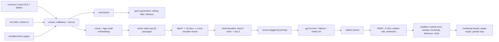

# Vizor

Vizor measures how an LLM answer engine surfaces, prioritizes and cites competing sources, and
runs controlled experiments on what changes that. It retrieves pages, builds a source-tagged
prompt, has a model write an answer with inline `[n]` citations, and scores every source with
the impression metrics from the GEO paper (Aggarwal et al., KDD 2024). A sandbox then edits the
target site's pages (metadata, FAQ, JSON-LD, internal links and so on) or the engine's retrieval
order, re-runs the same queries with the same seeds, and reports the shift with paired
confidence intervals. A contextual bandit learns which edit to apply where.

This repo was formerly RL-MCA-GEO. It is a rebuild: the earlier code asked the model to report
its own PAWC and filled gaps with random numbers, so none of it was kept except the pieces listed
under Credits.


## Quickstart (no API keys)

Needs Python 3.11 and [uv](https://docs.astral.sh/uv/).

```sh
make setup      # network: locked deps + pinned models into ./.models, verified against models.lock
make demo       # offline: full experiment with FakeLLM answers -> runs/<date>_demo/
make serve      # API on :8000     (in another shell)
make ui         # dashboard on :8501
```

Set `VIZOR_OFFLINE_RUN` to a wrapper that blocks outbound traffic for a whole process tree (on
macOS, a `sandbox-exec` profile that denies `network-outbound` except localhost), and
`make demo`, `make serve` and `make ui` run inside it. `make offline-check` proves the block is
real: the egress canary must fail inside the wrapper and succeed outside it. The same demo with no
model downloads at all is `vizor demo --config configs/ci.yaml`.

The keyless demo writes answers with **FakeLLM**, a deterministic extractive stand-in that picks
source sentences by embedding similarity and applies a fixed −0.05 per-slot position penalty. It
exists so the whole pipeline runs in CI and offline. Its numbers say nothing about real models,
and every report, table and dashboard page that shows them says so.

## How it works



The retrieval, generation and attribution stages form a cascade ("MCA" in the old name). The RL
part is the contextual bandit.

**Retrieval.** Pages become passages: head (title, description, headings), 120-word body windows
with 30-word overlap, one passage per FAQ pair, flattened JSON-LD, and a related-links line.
[bge-small-en-v1.5](https://huggingface.co/BAAI/bge-small-en-v1.5) embeds them. On macOS the
index is exact NumPy search (faiss, torch and scikit-learn each bundle a libomp, and loading them
together crashes). On Linux it is FAISS `IndexFlatIP`. Each index is tagged with the embedder id
(model, revision, dimension, preprocessing hash) and refuses queries from any other embedder.
Documents are scored by their best passage, and the top 15 are reranked with
`ms-marco-MiniLM-L-6-v2`. The final score is the sigmoid of the cross-encoder logit.

**Prompt.** Five sources, each shown with title, URL, meta description, structured data (JSON-LD,
up to 400 characters) and its three passages most relevant to the question. The instruction is
adapted from GEO's released prompt: every sentence cites its sources as `[1][2]`. Showing
metadata and JSON-LD to the model is how this sandbox engine works. It is not a claim about what
Perplexity or ChatGPT do internally.

**Metrics** (`src/vizor/metrics/impression.py`). For an answer with sentences S (N = |S|),
position i (zero-based) and the citations C(s) of each sentence:

    PAWC(c) = sum over sentences s citing c of  |s| * exp(-i / N) / |C(s)|, normalized over sources

So a sentence's words are split equally among its citations. `decay="reference"` uses
exp(−i/(N−1)) instead, which is what the authors' released code does. The test suite checks the
implementation against a hand-computed example and against the authors' own functions (vendored
under `tests/reference/`) on 200 random citation patterns. Beyond PAWC, per domain: Citation
Share-of-Voice (share of all `[n]` markers), citation rate, first-citation position, retrieved →
cited conversion, and an emphasized / cited / ignored label for each source in each answer.
Sentiment comes from `cardiffnlp/twitter-roberta-base-sentiment-latest` (P(pos) − P(neg)), both
over the sentences that cite a domain (PAWC-weighted) and over its retrieved passages. VADER is
the fallback.

**Sandbox** (`src/vizor/optimize/`). Each arm is applied to the query's focus page, meaning the
target page that retrieval ranked highest for it. The same queries then run again with the same
seed per (query, sample).

| Arm | What changes |
|---|---|
| `noop` | nothing; must give exactly zero (checks the pipeline and cache) |
| `aa_resample` | nothing on the page; fresh seeds. The noise floor for reading every other arm |
| `metadata` | title = H1 + the page's top query keyphrase; description from its own sentences |
| `faq_rewrite` | FAQ block: tracked queries the page can answer, answered with its own sentences |
| `jsonld_insert` | Product/Article + FAQPage JSON-LD from page facts (no Offer without a price on the page) |
| `internal_links` | links to the three most similar pages on the same site (real URLs) |
| `stats_surface`, `quote_surface` | move the page's existing numbers or quotes to the top |
| `keyword_stuffing` | append top query keywords (the paper's control) |
| `fluency`, `authoritative`, … | GEO's LLM rewrite prompts (real-model runs only) |
| `engine:reverse`, `target_at:p`, `boost:w` | retrieval order and weighting, pages untouched |

Arms that read the tracked queries (metadata, FAQ, keyword stuffing) are cross-fitted. They are
built from one half of the queries and scored on the other, so no page is edited with the exact
query it is then scored on. The unit of analysis is the query (mean over samples). The test is a
Wilcoxon signed-rank on per-query deltas, Holm-adjusted across the real arms, and the paired
bootstrap 95% CI (B = 5000) is descriptive. The position sweep forces one target page into
slots 1 to 5. The boost sweep adds w to the target pages' final score and splits queries by
whether the source set changed, only the order changed, or nothing changed.

**Bandit.** Contexts are the tracked queries, with 13 features of the focus page and query: FAQ,
JSON-LD, meta description length, words, links, the target's baseline retrieval, citation and
PAWC rates on that query (taken from the A/A re-sample so they don't share noise with the reward),
and the intent. Arms are the page edits. The reward is the change in the target's PAWC share, and
the reward table comes straight from the sandbox runs, so evaluation costs no extra calls. The
policies are LinUCB (Sherman–Morrison updates), linear Thompson sampling, ε-greedy, a bias-only
LinUCB ablation and random. They are compared by offline replay (2000 rounds × 20 runs) against
the per-query oracle, plus a held-out check: fit on one half of the queries, freeze, score the
other half. A greedy loop then applies the bandit's proposals one at a time and keeps an edit only
if the held-out CI lower bound is above zero. This is a contextual bandit with replay evaluation,
not deep RL.

## Results

Generated by `vizor report` from `experiments/results/`. Nothing in this block is typed by hand;
the full tables are in [experiments/RESULTS.md](experiments/RESULTS.md).

<!-- results:start (generated by `vizor report`, do not edit) -->
#### qwen2.5:3b-instruct via Ollama (small local model, reduced design)

- Results: `experiments/results/2026-09-23_qwen2.5-3b` (git 7511cb0, 2026-09-23)
- Answer model: `qwen2.5:3b-instruct`
- Retrieval: `sentence-transformers/BAAI/bge-small-en-v1.5/5c38ec7c405e/384/21fa4cb7` + `cross-encoder/cross-encoder/ms-marco-MiniLM-L-6-v2/233902d25c44`, index `numpy`
- Sentiment: `hf/cardiffnlp/twitter-roberta-base-sentiment-latest/3216a57f2a0d/p_pos-p_neg`; PAWC decay: paper
- 20 queries x 2 samples, 22 pages
- A small local model, not a GPT-class engine. It needed an extra system message (recorded in the manifest) before it would cite sentence by sentence.
- Local calls: 422 new, 218 cached (no API spend)

Test: Wilcoxon signed-rank on per-query deltas, Holm-adjusted across the non-control arms; `*` marks p(Holm) < 0.05. The bootstrap CI is descriptive. `noop` and `aa_resample` are controls outside the Holm family. Page arms that read the tracked queries are cross-fitted: built from one half of the queries, scored on the other. A/A noise band (re-sampled unchanged prompts): -3.4 [-11.3, +5.2] pp; 'Beyond A/A' says whether an arm's mean falls outside that band.

| Arm | ΔPAWC pp [95% CI] | Rel Δ % | ΔC-SoV pp [95% CI] | Δ cited pp | Δ retrieved pp | Δ sentiment | Uncited answers % | p (Holm) | Beyond A/A | n |
|---|---|---|---|---|---|---|---|---|---|---|
| `noop` | +0.0 [+0.0, +0.0] | +0 | +0.0 [+0.0, +0.0] | +0.0 | +0.0 | +0.000 | 2 | n/a |  | 20 |
| `aa_resample` | -3.4 [-11.3, +5.2] | -12 | -3.7 [-11.8, +5.1] | -7.5 | +0.0 | +0.102 | 0 | n/a |  | 20 |
| `metadata` | +0.9 [-6.3, +8.6] | +3 | +0.8 [-6.0, +7.7] | +2.5 | +0.0 | +0.070 | 2 | 1.000 | no | 20 |
| `faq_rewrite` | -7.7 [-17.8, +4.2] | -29 | -9.5 [-19.2, +0.8] | -20.0 | +0.0 | +0.019 | 8 | 0.318 | no | 20 |
| `jsonld_insert` | +1.9 [-6.6, +10.1] | +7 | +0.4 [-8.4, +8.6] | +2.5 | +0.0 | +0.112 | 0 | 1.000 | no | 20 |
| `internal_links` | -7.0 [-14.8, +0.7] | -26 | -8.9 [-15.7, -1.7] | -10.0 | +0.0 | +0.022 | 2 | 0.574 | no | 20 |
| `stats_surface` | -6.6 [-16.6, +3.3] | -25 | -7.3 [-16.8, +2.0] | -10.0 | +0.0 | +0.021 | 0 | 1.000 | no | 20 |
| `keyword_stuffing` | -0.7 [-5.5, +4.3] | -3 | -3.2 [-8.9, +2.3] | -2.5 | +0.0 | +0.068 | 2 | 1.000 | no | 20 |
| `engine:reverse` | +1.4 [-10.3, +12.5] | +5 | -1.0 [-12.9, +10.2] | -12.5 | +0.0 | +0.033 | 0 | 1.000 | no | 20 |

| Target slot | PAWC share % [95% CI] | Δ vs slot 1 pp [95% CI] | Cited % | p | n |
|---|---|---|---|---|---|
| 1 | 21.9 [13.0, 31.6] | ref | 58 |  | 19 |
| 3 | 33.6 [23.1, 44.8] | +11.7 [-4.1, +27.8] | 66 | 0.220 | 19 |
| 5 | 12.1 [6.1, 18.3] | -9.8 [-21.9, +1.8] | 37 | 0.116 | 19 |

Per-query classes compare the boosted source list with w=0: a different set of sources, the same sources in a different order, or no change. Each class cell is `n queries: mean ΔPAWC pp`.

| Boost w | Target retrieved % | PAWC share % [95% CI] | Δ vs w=0 pp [95% CI] | Cited % | p | Set changed | Order only | Unchanged |
|---|---|---|---|---|---|---|---|---|
| 0.00 | 75 | 26.9 [17.6, 35.8] | ref | 60 |  |  |  |  |
| 0.02 | 75 | 23.1 [13.4, 33.2] | -3.8 [-9.9, +2.1] | 50 | 0.289 | 1: -31.6 | 6: -7.4 | 13: +0.0 |
| 0.10 | 80 | 28.6 [17.1, 41.3] | +1.7 [-7.8, +11.7] | 58 | 0.821 | 7: +11.6 | 6: -7.9 | 7: +0.0 |

- Context order: with identical page content, moving the target from slot 1 to slot 5 changed its PAWC share from 21.9% to 12.1% (Δ -9.8 [-21.9, +1.8] pp, 1.8x, n=19 queries).
- Retrieval weighting: the median spread of final scores across the top 5 was 0.192 and the median gap between the 5th and 6th candidate 0.036. A boost of 0.02 moved target retrieval from 75% to 75% and PAWC share by -3.8 [-9.9, +2.1] pp. No boost in the sweep moved PAWC share with a CI excluding zero.
- Noise floor: re-sampling the unchanged prompts (A/A) moved PAWC share by -3.4 [-11.3, +5.2] pp.
- Metadata only (title + description): +0.9 [-6.3, +8.6] pp, Holm p 1.000.

#### FakeLLM (pipeline check)

- Results: `experiments/results/2026-09-24_fakellm` (git 7230b9d, 2026-09-24)
- Answer model: `fake-extractive/v1/BAAI/bge-small-en-v1.5` (deterministic extractive stand-in: a pipeline check, not model evidence)
- Retrieval: `sentence-transformers/BAAI/bge-small-en-v1.5/5c38ec7c405e/384/21fa4cb7` + `cross-encoder/cross-encoder/ms-marco-MiniLM-L-6-v2/233902d25c44`, index `numpy`
- Sentiment: `hf/cardiffnlp/twitter-roberta-base-sentiment-latest/3216a57f2a0d/p_pos-p_neg`; PAWC decay: paper
- 40 queries x 5 samples, 22 pages

Test: Wilcoxon signed-rank on per-query deltas, Holm-adjusted across the non-control arms; `*` marks p(Holm) < 0.05. The bootstrap CI is descriptive. `noop` and `aa_resample` are controls outside the Holm family. Page arms that read the tracked queries are cross-fitted: built from one half of the queries, scored on the other. A/A noise band (re-sampled unchanged prompts): +2.3 [-0.2, +4.9] pp; 'Beyond A/A' says whether an arm's mean falls outside that band.

| Arm | ΔPAWC pp [95% CI] | Rel Δ % | ΔC-SoV pp [95% CI] | Δ cited pp | Δ retrieved pp | Δ sentiment | Uncited answers % | p (Holm) | Beyond A/A | n |
|---|---|---|---|---|---|---|---|---|---|---|
| `noop` | +0.0 [+0.0, +0.0] | +0 | +0.0 [+0.0, +0.0] | +0.0 | +0.0 | +0.000 | 0 | n/a |  | 40 |
| `aa_resample` | +2.3 [-0.2, +4.9] | +12 | +1.9 [-0.2, +4.2] | +1.5 | +0.0 | +0.020 | 0 | n/a |  | 40 |
| `metadata` | +0.6 [-1.5, +2.7] | +3 | +0.7 [-1.2, +2.8] | -3.0 | +0.0 | +0.001 | 0 | 1.000 | no | 40 |
| `faq_rewrite` | +1.0 [-1.4, +3.5] | +5 | +0.5 [-1.6, +2.6] | +1.5 | -2.5 | -0.002 | 0 | 1.000 | no | 40 |
| `jsonld_insert` | +0.0 [+0.0, +0.0] | +0 | +0.0 [+0.0, +0.0] | +0.0 | +0.0 | +0.000 | 0 | 1.000 | no | 40 |
| `internal_links` | -0.7 [-1.6, +0.0] | -3 | -0.8 [-2.1, +0.0] | -2.5 | +0.0 | -0.010 | 0 | 1.000 | yes | 40 |
| `stats_surface` | -1.7 [-4.1, +0.9] | -8 | -1.2 [-3.5, +1.0] | -2.5 | -2.5 | -0.023 | 0 | 1.000 | yes | 40 |
| `quote_surface` | -1.9 [-5.3, +0.5] | -10 | -1.6 [-4.6, +0.6] | -3.5 | +0.0 | -0.004 | 0 | 1.000 | yes | 40 |
| `keyword_stuffing` | +1.5 [-0.4, +4.0] | +8 | +1.2 [-0.6, +3.6] | +1.5 | -2.5 | +0.000 | 0 | 1.000 | no | 40 |
| `engine:reverse` | +11.4 [+3.2, +19.5] | +58 | +9.5 [+2.6, +16.4] | +10.0 | +0.0 | +0.022 | 0 | 0.047 * | yes | 40 |

| Target slot | PAWC share % [95% CI] | Δ vs slot 1 pp [95% CI] | Cited % | p | n |
|---|---|---|---|---|---|
| 1 | 40.5 [37.1, 43.9] | ref | 90 |  | 39 |
| 2 | 24.2 [21.7, 26.8] | -16.3 [-19.7, -13.0] | 72 | <0.001 | 39 |
| 3 | 18.5 [15.2, 22.0] | -22.1 [-26.9, -17.1] | 61 | <0.001 | 39 |
| 4 | 10.3 [7.9, 12.9] | -30.2 [-34.0, -26.4] | 40 | <0.001 | 39 |
| 5 | 6.6 [5.2, 8.2] | -33.9 [-37.1, -30.6] | 29 | <0.001 | 39 |

Per-query classes compare the boosted source list with w=0: a different set of sources, the same sources in a different order, or no change. Each class cell is `n queries: mean ΔPAWC pp`.

| Boost w | Target retrieved % | PAWC share % [95% CI] | Δ vs w=0 pp [95% CI] | Cited % | p | Set changed | Order only | Unchanged |
|---|---|---|---|---|---|---|---|---|
| 0.00 | 80 | 19.7 [14.2, 25.4] | ref | 52 |  |  |  |  |
| 0.02 | 80 | 25.1 [18.4, 31.8] | +5.4 [+2.6, +8.7] | 58 | 0.004 | 4: +13.3 | 10: +16.3 | 26: +0.0 |
| 0.05 | 80 | 29.4 [22.1, 36.6] | +9.6 [+5.3, +14.4] | 61 | <0.001 | 9: +22.4 | 11: +16.8 | 20: +0.0 |
| 0.10 | 88 | 36.0 [28.6, 43.2] | +16.3 [+10.8, +21.9] | 70 | <0.001 | 14: +24.9 | 15: +20.2 | 11: +0.0 |

- FakeLLM applies an explicit −0.05 per-slot position penalty; this sweep recovers that built-in prior and is not evidence about real models.
<!-- results:end -->

**Reading these results.** The claim this project set out to test is that small changes in
retrieval weighting, context order or page metadata cause disproportionately large changes in
what the model cites. In the one real-model run so far (the small local model above, 20 queries
× 2 samples), that claim is **not supported**. No page arm, boost or slot change moved the
target's PAWC share with a Holm-adjusted p below 0.05. The largest point estimates sit inside or
near the A/A band, which is what re-sampling unchanged prompts produces by chance. At this
sample size the run can only detect shifts well beyond that band, so a null here is weak
evidence. The FakeLLM tables do show large position effects, but FakeLLM is built with a
position penalty, so those numbers only confirm the sweep code works.

The gpt-4o-mini run is set up but has not been run yet. `vizor estimate -c configs/openai.yaml`
puts it at up to 4,800 calls and about $2.13 at list prices. The run refuses to start above its
$3 cap, and a shared spend ledger enforces the cap across processes. With `OPENAI_API_KEY` set,
it is one command:

```sh
make experiment-openai && vizor report
```

## Real data

```sh
vizor ingest cc --pattern "*.example.com/*" --limit 20 --out data/myproject/corpus.jsonl
vizor ingest url https://example.com/page --out data/myproject/corpus.jsonl
vizor queries generate -c myconfig.yaml --out data/myproject/queries.jsonl
```

Common Crawl ingestion resolves `latest` through `collinfo.json`, parses CDX lines as JSON,
fetches WARC byte ranges (backoff on 503/SlowDown, about one request per second, cached under
`.cache/warc/`) and parses them with warcio. Point a project YAML at the corpus file and queries
(see `data/demo/project.yaml`). `configs/openai.yaml` and `configs/ollama.yaml` switch the answer
model, and a `base_url` also covers other OpenAI-compatible servers.

## API and UI

`vizor serve` starts FastAPI with these routes: `/health` (including the egress canary result
when `VIZOR_EGRESS_CANARY=1`), `/project`, `/corpus/docs[/{id}]`, `POST /answer` (live query →
sources, labels, per-sentence attribution), `POST /runs` and `POST /sandbox` (background jobs,
one at a time), `/jobs/{id}`, `/experiments[/{id}]`, `/experiments/{id}/answers/...` and
`/experiments/{id}/diffs`. The Streamlit dashboard has four views: overview, answer inspector,
sandbox (forest plot, sweeps, page diffs) and optimizer (regret curves, held-out check).

`docker compose up --build` runs both, mounting `.models/` read-only.
`make compose-offline` runs the same stack on an `internal: true` network and checks from inside
it that the API answers, the dashboard serves, and nothing can reach the internet.

## Layout

```
src/vizor/
  ingest/       commoncrawl.py live.py extract.py corpus.py
  retrieve/     chunk.py index.py rerank.py cascade.py
  generate/     prompt.py llm.py fake_llm.py engine.py
  attribution/  citations.py
  metrics/      impression.py visibility.py sentiment.py report.py
  optimize/     transforms.py retrieval_policy.py sandbox.py stats.py bandit.py reward.py
  api/ dashboard/  experiment.py cli.py models.py embed.py summarize.py queries.py
data/demo/      synthetic corpus (22 pages, 5 fictional sites) and 40 queries
experiments/    committed results and RESULTS.md
tests/          284 offline tests, incl. vendored GEO reference functions
```

## Limitations

- The sandbox engine is a model of an answer engine, not a production one. Real engines retrieve
  differently, may not show JSON-LD or meta descriptions to the model at all, and change without
  notice.
- One synthetic vertical, 22 short pages and 40 queries. Effects of a few percentage points are
  near the resolution of these samples, and the confidence intervals should be read that way.
- The local-model run uses a 3B model with a reduced design (20 queries × 2 samples). It needed an
  extra system message before it would cite sentence by sentence. It shows how a small local model
  behaves in this sandbox, not how GPT-class engines behave.
- OpenAI's `seed` is best effort, so common random numbers give little variance reduction there.
  The A/A arm, not `noop`, is the right noise reference for real-model runs.
- The sentiment model was trained on tweets, and product copy is a domain shift for it.
- The paper's `cite_sources` and `statistics_addition` rewrites let the model invent sources and
  numbers, so they are off unless `allow_fabrication` is set.
- Not verified here: a GitHub Actions run (the workflow is linted, not executed), and the
  gpt-4o-mini experiment (pending, see above).

## Credits

Vizor started at BostonHacks 2025 as a team project by Rohan Dutta, Akshay Irudayaraj and Krish
Maheshwari ([akshayirudayaraj/geo-bostonhacks](https://github.com/akshayirudayaraj/geo-bostonhacks)).
This repository is Krish's extended version. It adds the paper-exact PAWC (the hackathon version
weighted words by character position), FAISS/NumPy retrieval with cross-encoder reranking, the
statistical sandbox, the bandit, Common Crawl ingestion and the offline demo. From the earlier
RL-MCA-GEO code it keeps adapted versions of the Common Crawl fetcher, HTML and JSON-LD
extraction, the FAISS retriever, the cross-encoder reranker, the Ollama/OpenAI transports, the
JSON-LD shapes and the LinUCB policy.

The answer prompt, the LLM rewrite prompts and the reference impression functions used in the
tests come from [GEO-optim/GEO](https://github.com/GEO-optim/GEO) (Apache-2.0; see `NOTICE`).

```bibtex
@inproceedings{aggarwal2024geo,
  title     = {GEO: Generative Engine Optimization},
  author    = {Aggarwal, Pranjal and Murahari, Vishvak and Rajpurohit, Tanmay and Kalyan, Ashwin
               and Narasimhan, Karthik and Deshpande, Ameet},
  booktitle = {Proceedings of the 30th ACM SIGKDD Conference on Knowledge Discovery and Data Mining},
  year      = {2024},
  note      = {arXiv:2311.09735}
}
```

## License

MIT (see `LICENSE`). Vendored and adapted GEO material is Apache-2.0 (see `NOTICE`).
