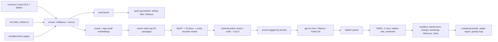

# Vizor

Vizor tests how changes to a page or retrieval order affect which sources an LLM answer engine
cites, using a simulated answer engine over small synthetic corpora (a 22-page demo and a
72-page bench, each on 5 fictional sites). It retrieves pages, puts source labels in the prompt, asks a model for an answer with
inline `[n]` citations, and scores each source with impression metrics from the GEO paper
(Aggarwal et al., KDD 2024). The sandbox edits a target site's metadata, FAQ, JSON-LD, or
internal links, or changes retrieval order. It then runs the same queries with the same seeds
and reports paired confidence intervals. A contextual bandit chooses edits by query; a held-out
check tests whether those choices carry over to new queries.

This repository was formerly RL-MCA-GEO. The earlier code asked the model to report its own
PAWC and filled gaps with random numbers. This rebuild keeps only the pieces listed under Credits.


## Quickstart (no API keys)

Needs Python 3.11 and [uv](https://docs.astral.sh/uv/).

```sh
make setup      # network: locked deps + pinned models into ./.models, verified against models.lock
make demo       # offline: full experiment with FakeLLM answers -> runs/<date>_demo/
make serve      # API on :8000     (in another shell)
make ui         # dashboard on :8501
```

On macOS, `OFFLINE_WRAPPER=scripts/offline-run make demo` runs the demo inside
`scripts/offline.sb`, a macOS sandbox-exec profile that denies outbound network except localhost,
for the whole process tree (the same works for `make serve` and `make ui`). `make offline-check` checks the block:
the egress canary must fail inside the wrapper and succeed outside it. To run the demo without
downloading models, use `vizor demo --config configs/ci.yaml`.

The keyless demo uses **FakeLLM** to write answers. This deterministic extractive stand-in picks
source sentences by embedding similarity and applies a fixed −0.05 per-slot position penalty.
It lets the pipeline run in CI and offline. Its numbers say nothing about real models, a limit
also stated in the reports, tables, and dashboard.

## How it works



Retrieval, generation, and attribution form the cascade ("MCA" in the old name). The contextual
bandit is the RL part.

**Retrieval.** Pages become passages: head (title, description, headings), 120-word body windows
with 30-word overlap, one passage per FAQ pair, flattened JSON-LD, and a related-links line.
[bge-small-en-v1.5](https://huggingface.co/BAAI/bge-small-en-v1.5) embeds them. On macOS the
index is exact NumPy search (faiss, torch and scikit-learn each bundle a libomp, and loading them
together crashes). On Linux it is FAISS `IndexFlatIP`. Each index is tagged with the embedder id
(model, revision, dimension, preprocessing hash) and refuses queries from any other embedder.
Documents are scored by their best passage, and the top 15 are reranked with
`ms-marco-MiniLM-L-6-v2`. The final score is the sigmoid of the cross-encoder logit.

**Prompt.** Five sources, each shown with title, URL, meta description, structured data (JSON-LD,
up to 400 characters) and its three passages most relevant to the question. The instruction is
adapted from GEO's released prompt: every sentence cites its sources as `[1][2]`. Showing
metadata and JSON-LD to the model is how this sandbox engine works. It is not a claim about what
Perplexity or ChatGPT do internally.

**Metrics** (`src/vizor/metrics/impression.py`). For an answer with sentences S (N = |S|),
position i (zero-based) and the citations C(s) of each sentence:

    PAWC(c) = sum over sentences s citing c of  |s| * exp(-i / N) / |C(s)|, normalized over sources

So a sentence's words are split equally among its citations. `decay="reference"` uses
exp(−i/(N−1)) instead, which is what the authors' released code does. The test suite checks the
implementation against a hand-computed example and against the authors' own functions (vendored
under `tests/reference/`) on 200 random citation patterns. Three deliberate differences from the
reference code outside those tests:

- an answer that cites nothing gives every source 0, not 1/n (`no_citation="uniform"` restores
  1/n);
- word counts include tokens of 2 characters or fewer (`wordcount="geo_reference"` drops them, as
  `get_num_words` does);
- a citation to a source index that wasn't in the prompt is dropped and counted as hallucinated,
  so it doesn't enter |C(s)|. The reference code keeps it in the divisor, and a `[0]` there
  silently credits the last source.

Beyond PAWC, per domain: Citation Share-of-Voice (share of all valid citation markers),
citation rate, first-citation position, retrieved → cited conversion, and an emphasized / cited /
ignored label for each source in each answer.

**Citation parsing** (`src/vizor/attribution/citations.py`). Besides `[1]`, `[1][2]`, `[1, 2]` and
`[1-3]`, the parser reads the forms small models actually write: `[Source 2]` (often as the
subject of a sentence, "[Source 3] states that ..."), `[Sources 1 and 3]`, `[Source [2]]`,
`(Source 2)`, and a bare "Source 2" in running text. A bare `(2)` is not read as a citation.
Anything left over that still looks like a citation attempt (say `[Source A]`) is kept as
"unparsed" and counted per arm, so a format failure shows up as such instead of as an uncited
answer. The parser is checked against 31 hand-read qwen2.5:3b answers from the committed run
(`tests/fixtures/qwen_citations.jsonl`); the parser before this change got 10 of them wrong.

**Brand mentions** (`src/vizor/metrics/mentions.py`). Citations and brand names disagree often:
an answer can cite a Brewline page without saying "Brewline", or name a Brewline product it read
on a review site without citing Brewline at all. So each answer also records whether it names
each site's brand (names from the project YAML, whole words, case-insensitive) and how many of
its sentences do. The "named rate" is reported next to PAWC and C-SoV, and is tested per arm.

Sentiment comes from `cardiffnlp/twitter-roberta-base-sentiment-latest` (P(pos) − P(neg)), both
over the sentences that cite a domain (PAWC-weighted) and over its retrieved passages. VADER is
the fallback.

**Sandbox** (`src/vizor/optimize/`). Each arm is applied to the query's focus page, meaning the
target page that retrieval ranked highest for it. The same queries then run again with the same
seed per (query, sample).

| Arm | What changes |
|---|---|
| `noop` | nothing; must give exactly zero (checks the pipeline and cache) |
| `aa_resample` | nothing on the page; fresh seeds. The noise floor for reading every other arm |
| `metadata` | title = H1 + the page's top query keyphrase; description from its own sentences |
| `faq_rewrite` | FAQ block: tracked queries the page can answer, answered with its own sentences |
| `jsonld_insert` | Product/Article + FAQPage JSON-LD from page facts (no Offer without a price on the page) |
| `internal_links` | links to the three most similar pages on the same site (real URLs) |
| `stats_surface`, `quote_surface` | move the page's existing numbers or quotes to the top |
| `keyword_stuffing` | append top query keywords (the paper's control) |
| `fluency`, `authoritative`, … | GEO's LLM rewrite prompts (real-model runs only) |
| `engine:reverse`, `target_at:p`, `boost:w` | retrieval order and weighting, pages untouched |

Arms that read the tracked queries (metadata, FAQ, keyword stuffing) are cross-fitted. They are
built from one half of the queries and scored on the other, so no page is edited with the exact
query it is then scored on. Deltas are per query (mean over samples). Queries served by the same
edited page aren't independent, so page arms are tested on (fold, page) units: the bootstrap
resamples units, and the Wilcoxon test runs on unit means. The verdict is the Holm-adjusted
Wilcoxon p on the run's primary metric (PAWC share unless the config says otherwise), with the
sweeps forming a second Holm family. The 95% CIs are descriptive. The position sweep forces one
target page into a given slot. The boost sweep adds w to the target pages' final score and splits
queries by whether the source set changed, only the order changed, or nothing changed.

**Content or rank?** Editing a page re-indexes it, so a page arm can change the answer in two
ways: through what the page now says, or through where retrieval now ranks it (and which other
pages it pushes out of the top five). A content-only twin, `content:<arm>`, applies the same edit
but takes the sources and their order from the unedited corpus, so only the edited page's text
changes. The full arm minus its twin is the rank-mediated part. Content-only arms are a separate
Holm family, and `decomposition.csv` holds the split for every edit that has a twin.

**Bandit.** The tracked queries are contexts. Each has 13 features of the focus page and query:
FAQ, JSON-LD, meta description length, words, links, intent, and the target's baseline retrieval,
citation, and PAWC rates. Those rates come from the A/A re-sample so they do not share noise with
the reward. The arms are page edits, and the reward is the change in the target's PAWC share.
The reward table comes from the sandbox runs, so evaluation costs no extra calls. The policies
are LinUCB (Sherman-Morrison updates), linear Thompson sampling, ε-greedy, a bias-only LinUCB
ablation, and random. Offline replay compares them with the per-query oracle over 2000 rounds ×
20 runs. Because that replay is in-sample, the held-out check fits on one half of the queries,
freezes the policy, and scores the other half. A greedy loop then applies the bandit's proposals
one at a time. It keeps an edit only if the held-out CI lower bound is above zero. This is a
contextual bandit with replay evaluation, not deep RL.

## Results

Generated by `vizor report` from `experiments/results/`. Nothing in this block is typed by hand;
the full tables are in [experiments/RESULTS.md](experiments/RESULTS.md).

The main result is the pre-registered bench run on qwen2.5:3b (design in
[docs/bench-design.md](docs/bench-design.md), written and committed before the run). The
2026-08-05 Qwen run further down is archived: its stored parses come from an earlier parser, and
`vizor recompute` reports `MISMATCH` for 26 of its 640 answers. Its tables are kept as historical
output and are not a current result.

<!-- results:start (generated by `vizor report`, do not edit) -->
#### qwen2.5:3b-instruct via Ollama, bench corpus (pre-registered main run)

- Results: `experiments/results/2026-09-05_bench-qwen3b` (git 0444d1e, 2026-09-05)
- Answer model: `qwen2.5:3b-instruct`
- Retrieval: `sentence-transformers/BAAI/bge-small-en-v1.5/5c38ec7c405e/384/21fa4cb7` + `cross-encoder/cross-encoder/ms-marco-MiniLM-L-6-v2/233902d25c44`, index `numpy`
- Sentiment: `hf/cardiffnlp/twitter-roberta-base-sentiment-latest/3216a57f2a0d/p_pos-p_neg`; PAWC decay: paper
- 72 queries x 5 samples, 72 pages
- System message (sha256 `aec4c3c34309`, full text in the manifest): “You answer questions using numbered search results. Write short sentences. Put a citation…”
- Primary metric for the verdict: citation share (C-SoV, share of the answer's valid markers)
- Local calls: 2530 new, 3230 cached (no API spend)

The verdict is the Holm-adjusted Wilcoxon p on the primary metric (citation share (C-SoV, share of the answer's valid markers)), below 0.05 (`*`). The brand-mention test (“named”: the answer names the target brand, with or without a citation) gets its own Holm adjustment. Content-only arms (`content:`) keep the baseline's sources and their order and change only the edited page's text; they form a separate Holm family. `noop` and `aa_resample` are controls outside every family. Page arms are tested on edited-page units (queries sharing an edited page are not independent); `n` is queries / units. The 95% CIs resample those units and are descriptive. The last four columns describe the arm's answers: no valid citation at all, citation-like text the parser could not map to a source, and every citation collected on the final sentence (for those answers PAWC's position weighting is meaningless). “Queries whose sources changed” counts queries where the arm changed the list of sources the model saw.

| Arm | ΔC-SoV pp [95% CI] (primary) | ΔPAWC pp [95% CI] | Δnamed pp [95% CI] | p (Holm, primary) | p (Holm, named) | Queries whose sources changed | Uncited % | Unparsed markers % | Cites only on last sentence % | n |
|---|---|---|---|---|---|---|---|---|---|---|
| `noop` | +0.0 [+0.0, +0.0] | +0.0 [+0.0, +0.0] | +0.0 [+0.0, +0.0] | control | control | 0 | 20 | 0.0 | 41 | 72 / 24 |
| `aa_resample` | +0.2 [-3.7, +4.4] | +0.7 [-3.4, +5.1] | -1.4 [-5.3, +2.5] | control | control |  | 18 | 0.3 | 40 | 72 / 72 |
| `metadata` | -2.3 [-7.0, +2.6] | -2.7 [-7.7, +2.7] | +1.1 [-2.3, +4.1] | 1.000 | 1.000 | 5 | 23 | 0.0 | 39 | 72 / 24 |
| `faq_rewrite` | -15.4 [-21.3, -9.2] | -15.7 [-21.8, -9.5] | -8.3 [-15.1, -2.1] | 0.003 * | 0.036 * | 10 | 27 | 0.0 | 40 | 72 / 24 |
| `jsonld_insert` | -3.2 [-6.4, +0.2] | -2.6 [-6.3, +1.3] | +4.4 [+0.0, +9.0] | 0.380 | 1.000 | 1 | 22 | 0.0 | 39 | 72 / 24 |
| `internal_links` | -5.2 [-9.5, -0.7] | -5.3 [-9.9, -0.5] | -2.5 [-4.8, +0.0] | 0.097 | 0.142 | 0 | 21 | 0.0 | 43 | 72 / 24 |
| `stats_surface` | -0.5 [-5.4, +4.6] | +0.1 [-5.0, +5.4] | +1.4 [-2.5, +5.4] | 1.000 | 1.000 | 25 | 17 | 0.0 | 42 | 72 / 24 |
| `keyword_stuffing` | +1.7 [-2.7, +6.4] | +1.9 [-2.6, +6.8] | -1.1 [-4.3, +1.9] | 1.000 | 1.000 | 2 | 18 | 0.3 | 42 | 72 / 24 |
| `content:metadata` | -2.4 [-6.5, +1.8] | -2.7 [-7.2, +1.8] | +0.0 [-3.3, +3.1] | 0.992 | 1.000 | 0 | 23 | 0.0 | 39 | 72 / 24 |
| `content:faq_rewrite` | -15.3 [-20.3, -9.8] | -15.7 [-20.7, -10.2] | -7.8 [-14.5, -1.8] | 0.003 * | 0.043 * | 0 | 27 | 0.0 | 42 | 72 / 24 |
| `content:jsonld_insert` | -3.5 [-6.7, +0.0] | -2.9 [-6.6, +1.1] | +3.1 [-1.4, +7.7] | 0.315 | 1.000 | 0 | 22 | 0.0 | 39 | 72 / 24 |
| `content:internal_links` | -5.2 [-9.5, -0.7] | -5.3 [-9.9, -0.5] | -2.5 [-4.8, +0.0] | 0.097 | 0.142 | 0 | 21 | 0.0 | 43 | 72 / 24 |
| `content:stats_surface` | +0.8 [-3.1, +4.9] | +1.4 [-2.5, +5.6] | +0.8 [-4.0, +5.5] | 0.992 | 1.000 | 0 | 18 | 0.3 | 42 | 72 / 24 |
| `content:keyword_stuffing` | +0.6 [-3.4, +4.9] | +0.8 [-3.3, +5.2] | -0.6 [-3.9, +2.4] | 0.992 | 1.000 | 0 | 18 | 0.3 | 41 | 72 / 24 |

Each page edit split into what the new text did with the same sources in the same order (content-only arm) and what it did by changing retrieval (full arm minus content-only arm, paired per query). Total = content + rank-mediated. The p next to the rank-mediated effect is an unadjusted Wilcoxon on page units.

| Page edit | Total ΔC-SoV pp | Content-only ΔC-SoV pp | Rank-mediated ΔC-SoV pp | Total Δnamed pp | Content-only Δnamed pp | Rank-mediated Δnamed pp | Queries whose sources changed |
|---|---|---|---|---|---|---|---|
| `metadata` | -2.3 [-7.0, +2.6] | -2.4 [-6.5, +1.8] | +0.1 [-1.7, +2.4] (p 0.738) | +1.1 [-2.3, +4.1] | +0.0 [-3.3, +3.1] | +1.1 [+0.0, +2.4] | 5 |
| `faq_rewrite` | -15.4 [-21.3, -9.2] | -15.3 [-20.3, -9.8] | -0.1 [-2.2, +1.9] (p 0.964) | -8.3 [-15.1, -2.1] | -7.8 [-14.5, -1.8] | -0.6 [-1.7, +0.0] | 10 |
| `jsonld_insert` | -3.2 [-6.4, +0.2] | -3.5 [-6.7, +0.0] | +0.3 [+0.0, +0.9] (p 0.700) | +4.4 [+0.0, +9.0] | +3.1 [-1.4, +7.7] | +1.4 [+0.0, +4.3] | 1 |
| `internal_links` | -5.2 [-9.5, -0.7] | -5.2 [-9.5, -0.7] | +0.0 [+0.0, +0.0] (p 1.000) | -2.5 [-4.8, +0.0] | -2.5 [-4.8, +0.0] | +0.0 [+0.0, +0.0] | 0 |
| `stats_surface` | -0.5 [-5.4, +4.6] | +0.8 [-3.1, +4.9] | -1.3 [-5.1, +1.9] (p 0.920) | +1.4 [-2.5, +5.4] | +0.8 [-4.0, +5.5] | +0.6 [-1.7, +2.8] | 25 |
| `keyword_stuffing` | +1.7 [-2.7, +6.4] | +0.6 [-3.4, +4.9] | +1.1 [+0.0, +2.9] (p 0.458) | -1.1 [-4.3, +1.9] | -0.6 [-3.9, +2.4] | -0.6 [-1.6, +0.0] | 2 |

| Target slot | C-SoV % | PAWC share % [95% CI] | ΔC-SoV vs slot 1 pp [95% CI] | Cited % | p (Holm, sweeps) | n |
|---|---|---|---|---|---|---|
| 1 | 43.1 | 43.8 [35.0, 52.6] | ref | 72 |  | 36 |
| 5 | 13.0 | 12.6 [5.7, 20.9] | -30.1 [-39.9, -20.5] | 22 | <0.001 * | 36 |

- Context order (same pages, target forced into each slot, n=36 queries): C-SoV slot 1 43.1%, slot 5 13.0%. Holm-significant differences: slot 5 vs 1: -30.1 [-39.9, -20.5] pp (Holm p <0.001).
- How fragile the slot 5 result is: its raw p is <0.001 over 36 queries, but those queries are served by only 17 target pages. Per page, slot 5 minus slot 1 on C-SoV is beam-800 -51.6, floor-pump -90.0, fold-20 -33.4, gravel-gx -18.3, chain-care -46.4, first-commute -10.0, flat-tire -7.5, tire-pressure +1.3, haul -61.1, lock-d9 -41.4, metro-7 -54.3, pannier-20 -40.0, shell +8.7, spin-t2 +16.9, sprout-16 -30.8, gear-indexing -2.0, volt-e1 -13.1 pp, and a Wilcoxon test on the page means gives p = 0.001. It also depends on the sweeps forming their own Holm family: in one family with the arms (13 tests) its Holm p would be <0.001.
- Noise floor: re-sampling the unchanged prompts (A/A) moved C-SoV by +0.2 [-3.7, +4.4] pp and the named rate by -1.4 [-5.3, +2.5] pp.
- Page and engine arms: 1 of 6 have a Holm-significant effect on C-SoV: `faq_rewrite`; 1 of 6 on the named rate: `faq_rewrite`.
- Content-only arms: 1 of 6 have a Holm-significant effect on C-SoV: `content:faq_rewrite`; 1 of 6 on the named rate: `content:faq_rewrite`.
- Content vs rank: for 2 of 6 page edits the rank-mediated part of the C-SoV change is larger in size than the content-only part (point estimates; see the decomposition table for intervals).
- Weighting: the C-SoV estimates and intervals above weight every query equally, while the Wilcoxon test ranks unweighted page means. The page means are `metadata` -1.8, `faq_rewrite` -14.1, `jsonld_insert` -2.5, `internal_links` -4.6, `stats_surface` 0.6, `keyword_stuffing` 2.5, `content:metadata` -2.1, `content:faq_rewrite` -13.7, `content:jsonld_insert` -2.7, `content:internal_links` -4.6, `content:stats_surface` 1.6, `content:keyword_stuffing` 1.5 pp.
- Minimum detectable effect on C-SoV (80% power, strictest Holm step, normal approximation, from the A/A re-sample; per-query A/A SD 17.7 pp): page edits ≈ 7.9 pp (8.5 pp with t quantiles) on 24 underlying page units (both cross-fit folds clustered by page); content-only arms ≈ 7.9 pp; named rate for page edits ≈ 7.6 pp; slot sweep ≈ 8.3 pp. These are approximate: the test is a Wilcoxon signed-rank test, not a t test. Effects smaller than these could be missed.
- Positive control (target moved from slot 1 to slot 5, same pages): C-SoV -30.1 [-39.9, -20.5] pp, Holm p <0.001 *.
- Bandit, held out: the frozen contextual policy had regret 6.268 (±2.233) vs 7.705 for random and 5.772 for the best fixed arm chosen on the training half. On the held-out queries it is not distinguishable from random.

#### qwen2.5:3b-instruct via Ollama, bench corpus (pre-registered main run), pilot: baseline and A/A only

- Results: `experiments/results/2026-09-05_bench-qwen3b-pilot` (git 0a441a4, 2026-09-05)
- Answer model: `qwen2.5:3b-instruct`
- Retrieval: `sentence-transformers/BAAI/bge-small-en-v1.5/5c38ec7c405e/384/21fa4cb7` + `cross-encoder/cross-encoder/ms-marco-MiniLM-L-6-v2/233902d25c44`, index `numpy`
- Sentiment: `hf/cardiffnlp/twitter-roberta-base-sentiment-latest/3216a57f2a0d/p_pos-p_neg`; PAWC decay: paper
- 72 queries x 5 samples, 72 pages
- System message (sha256 `aec4c3c34309`, full text in the manifest): “You answer questions using numbered search results. Write short sentences. Put a citation…”
- Primary metric for the verdict: citation share (C-SoV, share of the answer's valid markers)
- Local calls: 720 new, 360 cached (no API spend)

The verdict is the Holm-adjusted Wilcoxon p on the primary metric (citation share (C-SoV, share of the answer's valid markers)), below 0.05 (`*`). The brand-mention test (“named”: the answer names the target brand, with or without a citation) gets its own Holm adjustment. `noop` and `aa_resample` are controls outside every family. Page arms are tested on edited-page units (queries sharing an edited page are not independent); `n` is queries / units. The 95% CIs resample those units and are descriptive. The last four columns describe the arm's answers: no valid citation at all, citation-like text the parser could not map to a source, and every citation collected on the final sentence (for those answers PAWC's position weighting is meaningless). “Queries whose sources changed” counts queries where the arm changed the list of sources the model saw.

| Arm | ΔC-SoV pp [95% CI] (primary) | ΔPAWC pp [95% CI] | Δnamed pp [95% CI] | p (Holm, primary) | p (Holm, named) | Queries whose sources changed | Uncited % | Unparsed markers % | Cites only on last sentence % | n |
|---|---|---|---|---|---|---|---|---|---|---|
| `noop` | +0.0 [+0.0, +0.0] | +0.0 [+0.0, +0.0] | +0.0 [+0.0, +0.0] | control | control | 0 | 20 | 0.0 | 41 | 72 / 24 |
| `aa_resample` | +0.2 [-3.7, +4.4] | +0.7 [-3.4, +5.1] | -1.4 [-5.3, +2.5] | control | control |  | 18 | 0.3 | 40 | 72 / 72 |

- Noise floor: re-sampling the unchanged prompts (A/A) moved C-SoV by +0.2 [-3.7, +4.4] pp and the named rate by -1.4 [-5.3, +2.5] pp.
- Minimum detectable effect on C-SoV (for the planned design of 6 page edits and 6 content-only twins, each its own Holm family; 80% power, strictest Holm step, normal approximation, from the A/A re-sample; per-query A/A SD 17.7 pp): page edits ≈ 7.9 pp (8.5 pp with t quantiles) on 24 underlying page units (both cross-fit folds clustered by page); content-only arms ≈ 7.9 pp; named rate for page edits ≈ 7.6 pp. These are approximate: the test is a Wilcoxon signed-rank test, not a t test. Effects smaller than these could be missed.

#### FakeLLM (pipeline check)

- Results: `experiments/results/2026-08-05_fakellm` (git b9f509a, 2026-08-20)
- Answer model: `fake-extractive/v1/BAAI/bge-small-en-v1.5` (deterministic extractive stand-in; pipeline check, not model evidence)
- Retrieval: `sentence-transformers/BAAI/bge-small-en-v1.5/5c38ec7c405e/384/21fa4cb7` + `cross-encoder/cross-encoder/ms-marco-MiniLM-L-6-v2/233902d25c44`, index `numpy`
- Sentiment: `hf/cardiffnlp/twitter-roberta-base-sentiment-latest/3216a57f2a0d/p_pos-p_neg`; PAWC decay: paper
- 40 queries x 5 samples, 22 pages

An arm counts as having an effect when its Holm-adjusted Wilcoxon p-value is below 0.05 (`*`). The 95% confidence intervals are descriptive. `noop` and `aa_resample` are controls and are excluded from the Holm family. Page arms change each query's focus page. They are tested across (fold, page) units because queries that share an edited page are not independent; `n` reports queries / units. Arms that use the tracked queries are cross-fitted: built on one half of the queries and scored on the other. "ΔPAWC if cited" counts only answers with citations. Citation-format failures instead appear in the uncited rate.

| Arm | ΔPAWC pp [95% CI] | Rel Δ % | ΔC-SoV pp [95% CI] | Δ cited pp | ΔPAWC if cited pp | Uncited answers % | Δ sentiment | p (Holm) | n |
|---|---|---|---|---|---|---|---|---|---|
| `noop` | +0.0 [+0.0, +0.0] | +0 | +0.0 [+0.0, +0.0] | +0.0 | +0.0 | 0 | +0.000 | control | 40 / 5 |
| `aa_resample` | +2.6 [-0.0, +5.2] | +13 | +2.1 [+0.0, +4.3] | +2.0 | +2.6 | 0 | +0.011 | control | 40 / 40 |
| `metadata` | +0.6 [-1.4, +2.3] | +3 | +0.6 [-1.5, +2.4] | -2.5 | +0.6 | 0 | -0.007 | 1.000 | 40 / 10 |
| `faq_rewrite` | +1.3 [-2.2, +4.0] | +7 | +0.7 [-2.0, +2.8] | +2.5 | +1.3 | 0 | -0.010 | 1.000 | 40 / 10 |
| `jsonld_insert` | +0.0 [+0.0, +0.0] | +0 | +0.0 [+0.0, +0.0] | +0.0 | +0.0 | 0 | +0.000 | 1.000 | 40 / 5 |
| `internal_links` | -0.7 [-1.1, +0.0] | -3 | -0.8 [-1.6, +0.0] | -2.5 | -0.7 | 0 | -0.010 | 1.000 | 40 / 5 |
| `stats_surface` | -1.5 [-2.8, -0.6] | -8 | -1.1 [-1.8, +0.1] | -2.5 | -1.5 | 0 | -0.047 | 1.000 | 40 / 5 |
| `quote_surface` | -2.1 [-3.7, +0.0] | -11 | -1.7 [-3.1, +0.0] | -4.0 | -2.1 | 0 | -0.023 | 1.000 | 40 / 5 |
| `keyword_stuffing` | +1.7 [-0.6, +3.5] | +9 | +1.2 [-1.0, +2.9] | +2.0 | +1.7 | 0 | -0.006 | 1.000 | 40 / 10 |
| `engine:reverse` | +11.4 [+3.2, +19.7] | +59 | +9.7 [+2.9, +16.8] | +11.0 | +11.4 | 0 | +0.025 | 0.075 | 40 / 40 |

| Target slot | PAWC share % [95% CI] | ΔPAWC vs slot 1 pp [95% CI] | Cited % | p (Holm, sweeps) | n |
|---|---|---|---|---|---|
| 1 | 40.2 [36.9, 43.4] | ref | 90 |  | 39 |
| 2 | 24.5 [22.0, 27.1] | -15.7 [-19.0, -12.4] | 73 | <0.001 * | 39 |
| 3 | 18.2 [14.9, 21.7] | -21.9 [-26.6, -17.2] | 59 | <0.001 * | 39 |
| 4 | 10.1 [7.7, 12.7] | -30.1 [-33.8, -26.2] | 39 | <0.001 * | 39 |
| 5 | 6.8 [5.4, 8.4] | -33.4 [-36.4, -30.2] | 29 | <0.001 * | 39 |

For each query, these classes compare the boosted source list with w=0: a different set of sources, the same sources in a different order, or no change. Each cell shows `n queries: mean ΔPAWC pp`.

| Boost w | Target retrieved % | PAWC share % [95% CI] | Δ vs w=0 pp [95% CI] | Cited % | p (Holm, sweeps) | Set changed | Order only | Unchanged |
|---|---|---|---|---|---|---|---|---|
| 0.00 | 80 | 19.5 [14.0, 25.3] | ref | 52 |  |  |  |  |
| 0.02 | 80 | 24.9 [18.1, 31.7] | +5.4 [+2.5, +8.8] | 58 | 0.004 * | 4: +13.3 | 10: +16.2 | 26: +0.0 |
| 0.05 | 80 | 29.4 [22.1, 36.7] | +9.9 [+5.5, +14.7] | 61 | <0.001 * | 9: +22.5 | 11: +17.5 | 20: +0.0 |
| 0.10 | 88 | 35.7 [28.4, 42.9] | +16.2 [+10.9, +21.7] | 70 | <0.001 * | 14: +24.1 | 15: +20.8 | 11: +0.0 |

- FakeLLM applies an explicit −0.05 per-slot position penalty; this sweep recovers that built-in prior and is not evidence about real models.
<!-- results:end -->

**Reading these results.** The bench run asked whether six common page edits change how often a
small local model cites the target site. Each edit was tested on 24 target pages and 72 queries,
with 5 sampled answers per query, and an effect counts only if its Holm-adjusted Wilcoxon p is
below 0.05.

- The FAQ rewrite lowered the target's citation share by 15.4 points (95% CI -21.3 to -9.2) and
  the rate at which answers name the brand by 8.3 points. The same edit with the sources and
  their order held fixed gave -15.3 points, so the drop comes from what the new text says, not
  from where the page lands in retrieval. Looking at the prompts, the added FAQ passages push
  the spec and fact passages out of the three passages each source gets in the prompt.
- The other five edits (metadata, JSON-LD, internal links, surfacing stats, keyword stuffing)
  showed no effect the run could detect. The run could reliably see a change of about 8-9
  points, so smaller effects may exist and were missed.
- Moving the target page from the first to the fifth source slot, with nothing else changed,
  lowered its citation share by 30 points. This is the positive control: the measurement can
  see a real effect when there is one.
- 17-27% of answers, depending on the arm, cite nothing at all, even with a system message that
  asks for a citation on every sentence.

A second study with a lower-noise metric and edits chosen from this diagnosis is pre-registered
in [docs/bench-design-study2.md](docs/bench-design-study2.md). It has not been run yet.

The FakeLLM tables show large position effects only because FakeLLM is built with a position
penalty, so they confirm the sweep code works and nothing more. The GEO LLM rewrite arms
(`fluency`, `authoritative` and the rest) need a real model and `llm_rewrites: true`, and no
committed run has them.

The archived local run uses one prompt change from the OpenAI config. qwen2.5:3b mostly ignored the
in-line citation rule, so `configs/ollama.yaml` adds this system message (its example facts are
made up and not from the corpus):

> You answer questions using numbered search results. Write short sentences. Put a citation in
> square brackets at the end of EVERY sentence, right before the period, naming the search
> result that supports that sentence. Format example, with made-up facts unrelated to any
> question: "The Harrow bicycle weighs 9 kg [2]. It ships in three colours [2]. The Linden has a
> steel frame [4]." Never collect citations at the end of the answer.

The gpt-4o-mini run is configured but has not been run yet. `vizor estimate -c configs/openai.yaml`
bounds it at 4,800 answer calls plus 20 rewrite calls, about $2.90 at list prices. The run refuses
to start if that bound plus what the shared spend ledger has already recorded exceeds its $3 cap,
and every call reserves its worst-case cost before it is sent. With `OPENAI_API_KEY` set,
it is one command:

```sh
make experiment-openai && vizor report
```

## Real data

```sh
vizor ingest cc --pattern "*.example.com/*" --limit 20 --out data/myproject/corpus.jsonl
vizor ingest url https://example.com/page --out data/myproject/corpus.jsonl
vizor queries generate -c myconfig.yaml --out data/myproject/queries.jsonl
```

Common Crawl ingestion resolves `latest` through `collinfo.json`, parses CDX lines as JSON,
fetches WARC byte ranges (backoff on 503/SlowDown, about one request per second, cached under
`.cache/warc/`) and parses them with warcio. Point a project YAML at the corpus file and queries
(see `data/demo/project.yaml`). `configs/openai.yaml` and `configs/ollama.yaml` switch the answer
model, and a `base_url` also covers other OpenAI-compatible servers.

## API and UI


`vizor serve` starts FastAPI with these routes: `/health` (including the egress canary result
when `VIZOR_EGRESS_CANARY=1`), `/project`, `/corpus/docs[/{id}]`, `POST /answer` (live query →
sources, labels, per-sentence attribution), `POST /runs` and `POST /sandbox` (background jobs,
one at a time), `/jobs/{id}`, `/experiments[/{id}]`, `/experiments/{id}/answers/...` and
`/experiments/{id}/diffs`. The Streamlit dashboard has four views: overview, answer inspector,
sandbox (forest plot, sweeps, page diffs) and optimizer (regret curves, held-out check).

`docker compose up --build` runs both, mounting `.models/` read-only.
`make compose-offline` runs the same stack on an `internal: true` network and checks from inside
it that the API answers, the dashboard serves, and nothing can reach the internet.

## Layout

```
src/vizor/
  ingest/       commoncrawl.py live.py extract.py corpus.py
  retrieve/     chunk.py index.py rerank.py cascade.py
  generate/     prompt.py llm.py fake_llm.py engine.py
  attribution/  citations.py
  metrics/      impression.py visibility.py sentiment.py report.py
  optimize/     transforms.py retrieval_policy.py sandbox.py stats.py bandit.py reward.py
  api/ dashboard/  experiment.py cli.py models.py embed.py summarize.py queries.py
data/demo/      synthetic corpus (22 pages, 5 fictional sites) and 40 queries
data/bench/     larger synthetic corpus (72 pages, 24 of them target pages) and 72 queries
experiments/    committed results and RESULTS.md
tests/          361 offline tests, incl. vendored GEO reference functions
```

## Limitations

- All real-model results come from one small local model (qwen2.5:3b through Ollama). Nothing
  here says anything about ChatGPT, Perplexity or any other production engine.
- The sandbox engine is a model of an answer engine, not a production one. Real engines retrieve
  differently, may not show JSON-LD or meta descriptions to the model at all, and change without
  notice.
- The bench corpus is synthetic and was written knowing which edits would be tested: the target
  pages have no FAQ block and no JSON-LD, so those edits always had something to add. The
  queries are hand-written, 3 per topic, and the cross-fitted edits saw same-topic sibling
  queries, so "held out" means a held-out query, not a held-out topic.
- The bench run can detect effects of about 8-9 points on citation share. Smaller effects of the
  kind real sites might care about are below its resolution.
- The headline rule counts an edit if it passes on citation share or on the named rate, each at
  0.05, so its false-claim rate is up to about 0.10.
- Many answers cite nothing (17-27% per arm), and citation share is computed over the markers
  the model did write.
- The archived 2026-08-05 local run uses a reduced design (20 queries x 2 samples), its stored
  parses fail recomputation, and it has no power for page edits.
- OpenAI's `seed` is best effort, so common random numbers give little variance reduction there.
  The A/A arm, not `noop`, is the right noise reference for real-model runs.
- The sentiment model was trained on tweets, and product copy is a domain shift for it.
- The paper's `cite_sources` and `statistics_addition` rewrites let the model invent sources and
  numbers, so they are off unless `allow_fabrication` is set.
- Not verified here: a GitHub Actions run (the workflow is linted, not executed), and the
  gpt-4o-mini experiment (configured, not run).

## Credits

Vizor started at BostonHacks 2025 as a team project by Rohan Dutta, Akshay Irudayaraj and Krish
Maheshwari ([akshayirudayaraj/geo-bostonhacks](https://github.com/akshayirudayaraj/geo-bostonhacks)).
This repository is Krish's extended version. It adds the paper-exact PAWC (the hackathon version
weighted words by character position), FAISS/NumPy retrieval with cross-encoder reranking, the
statistical sandbox, the bandit, Common Crawl ingestion and the offline demo. From the earlier
RL-MCA-GEO code it keeps adapted versions of the Common Crawl fetcher, HTML and JSON-LD
extraction, the FAISS retriever, the cross-encoder reranker, the Ollama/OpenAI transports, the
JSON-LD shapes and the LinUCB policy.

The answer prompt, the LLM rewrite prompts and the reference impression functions used in the
tests come from [GEO-optim/GEO](https://github.com/GEO-optim/GEO) (Apache-2.0; see `NOTICE`).

```bibtex
@inproceedings{aggarwal2024geo,
  title     = {GEO: Generative Engine Optimization},
  author    = {Aggarwal, Pranjal and Murahari, Vishvak and Rajpurohit, Tanmay and Kalyan, Ashwin
               and Narasimhan, Karthik and Deshpande, Ameet},
  booktitle = {Proceedings of the 30th ACM SIGKDD Conference on Knowledge Discovery and Data Mining},
  year      = {2024},
  note      = {arXiv:2311.09735}
}
```

## License

MIT (see `LICENSE`). Vendored and adapted GEO material is Apache-2.0 (see `NOTICE`).
